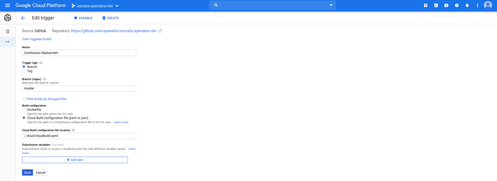
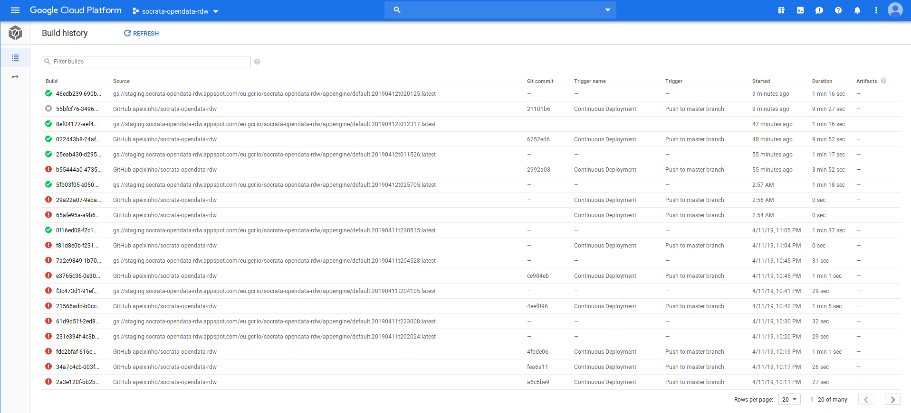
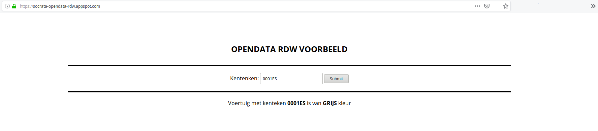

# Socrata OpenData RDW Example

The proposed challenge is to use [RDW API](https://dev.socrata.com/foundry/opendata.rdw.nl/m9d7-ebf2) in order to fetch vehicle information, more specifically color, based on the license plate.

## Acceptance Criteria

- The API has a GET method for license plate
- The API gives the color of the corresponding vehicle as a response
- The API is publicly accessible;
- Uses the Open Data API from https://dev.socrata.com/foundry/opendata.rdw.nl/m9d7-ebf2 to retrieve the required information
- The runtime runs in a cloud environment;
- Source code of solution to deploy the runtime
- Deployment are automated

## Continuous Deployment and Google Cloud Platform

The application is deployed on **Google Cloud Platform** and publicly available at: [https://socrata-opendata-rdw.appspot.com](https://socrata-opendata-rdw.appspot.com)

It uses _Google Cloud Build_ and _Google Cloud Trigger_ to automatically deploy a _NodeJS_ application to _Google App Engine_ .

It applies _Continuous and Automated Deployments_ when changes are pushed to the **master** branch as described in the following image.

The following image shows several builds invoked by pushes to _GitHub_ on the **master** branch

The following image describes a license plate submission (e.g. **0001ES** ) and consequent response

